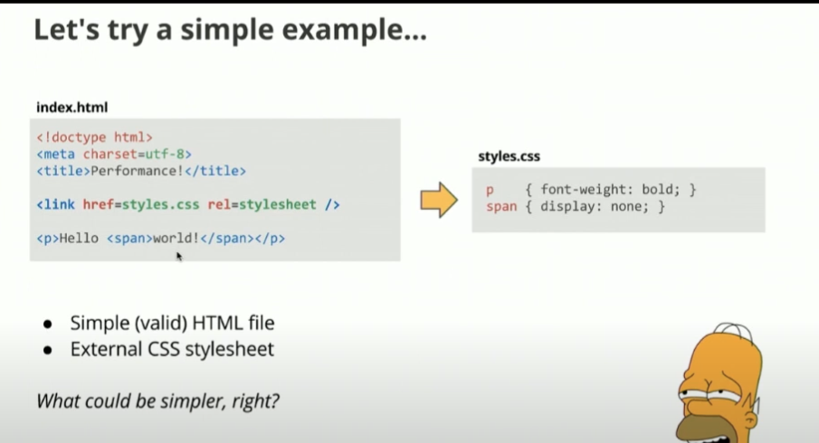
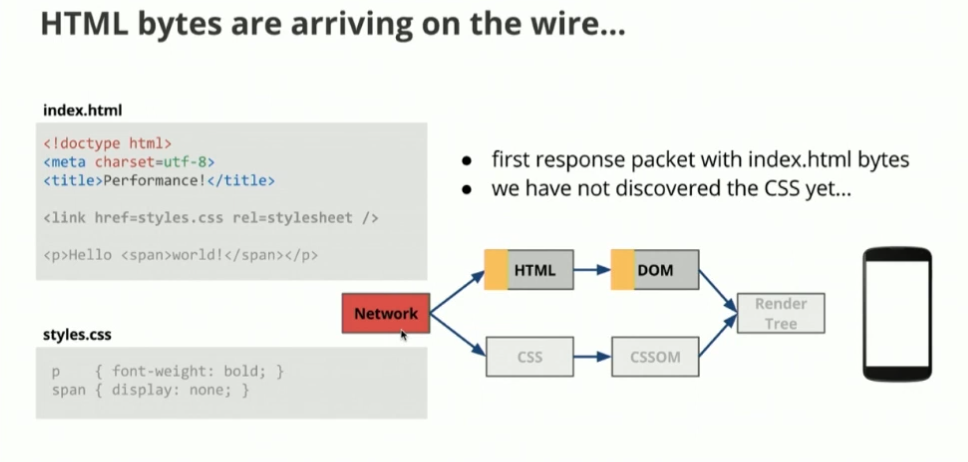
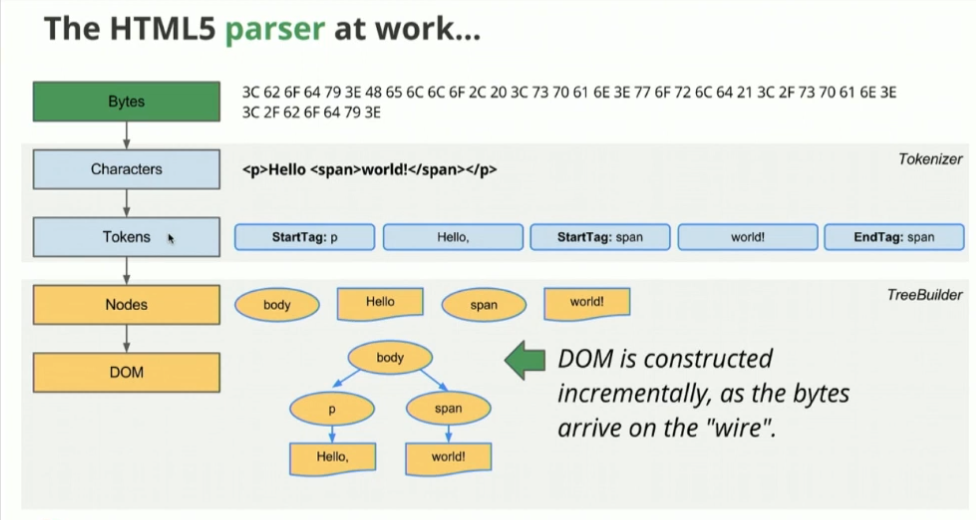
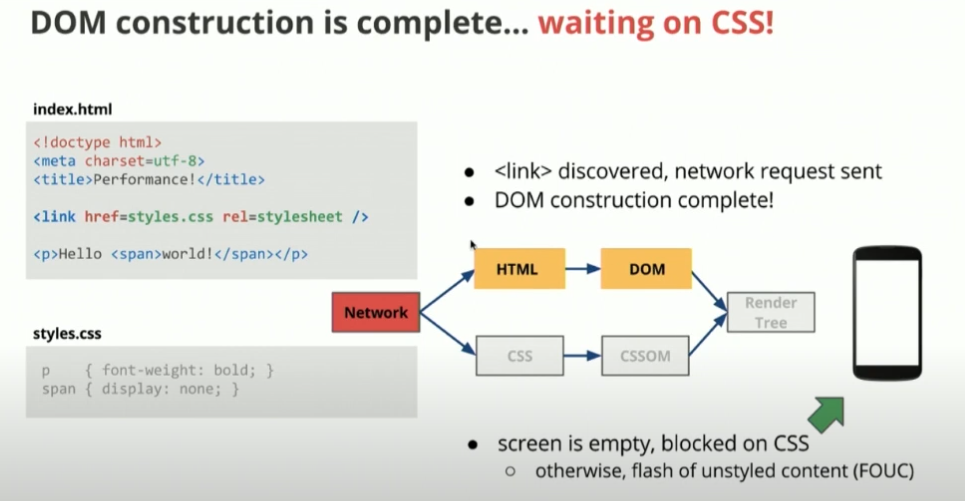
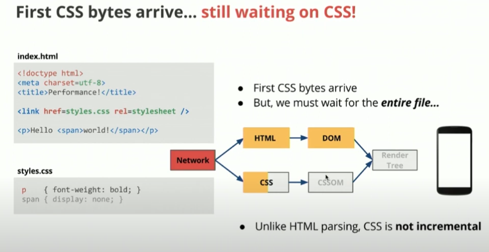

# Critical Rendering Path (CRP)

## Resources

https://web.dev/learn/performance/understanding-the-critical-path
https://hpbn.co/primer-on-web-performance/#hypertext-web-pages-and-web-applications
https://www.freecodecamp.org/news/an-introduction-to-web-performance-and-the-critical-rendering-path-ce1fb5029494/
https://developer.chrome.com/docs/devtools/performance/selector-stats

<!-- TODO: write code  -->

### Lets try out a simple example - Branch: example-1-inline-critical-css

1. A page with a large stylesheet that blocks rendering
2. A page with the same stylesheet but optimized for CRP

3. `index.html` - The unoptimized version that loads a large stylesheet synchronously
4. `styles.css` - A large stylesheet with many unused rules to simulate a real-world scenario
5. `optimized.html` - An optimized version that demonstrates better CRP practices

To demonstrate the difference:

1. Open `index.html` in your browser and observe how the page loads. You'll notice that the page appears blank until the large stylesheet is fully loaded and parsed.

2. Then open `optimized.html` and you'll see that the above-the-fold content appears immediately, while the rest of the styles load asynchronously.

The key differences in the optimized version are:

1. Critical CSS is inlined in the `<head>` using a `<style>` tag
2. Non-critical CSS is loaded asynchronously using `preload` and `onload`
3. The page structure is the same, but the loading strategy is different

---

4. Use Chrome DevTools' Network tab to simulate slow connections
5. Use the Performance tab to record and analyze the rendering process
6. Compare the First Contentful Paint (FCP) and Largest Contentful Paint (LCP) metrics between both versions
